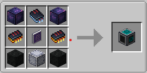

# AI Pattern Forge 1.3.2

## Ctrl+A now selects items, not search text

Pressing **Ctrl+A** in the terminal now always selects every visible craftable recipe, even when
the search box is focused. Previously the search field caught the shortcut and just highlighted
its own text. Triple-click in the search box still works for selecting text.

## Tab-hold recipe overlay

Hover an item in the grid and **hold Tab** to see its recipe overlaid near the cursor:

- Crafting recipes show the 3x3 input grid (shaped or shapeless) + arrow + result.
- Smelting / Blasting / Smoking / Campfire / Stonecutting show input -> arrow -> result.
- Releasing Tab dismisses the overlay and returns to the normal item tooltip.

Recipes are resolved client-side via `RecipeManager.byKey(...)`, so no extra packets are sent
to the server.

## Performance

- Catalog build budget bumped from 256 to 1024 entries per client tick, so the first-open lag on
  large modpacks drops to roughly a quarter of what it was. The catalog still builds in the
  background after world join, so by the time you open the terminal it's usually already ready.
- Grid items now render via `GuiGraphics.renderFakeItem`, which skips the durability-bar and
  cooldown-overlay setup. Modest gain per cell, but with up to 126 cells rendered at 60 fps in
  Full mode it adds up.

## Features

- Searches every block item in the loaded pack.
- Search syntax: plain text, `@modid` to filter by mod, `#tag` to filter by item tag, combined freely (e.g. `@minecraft #wool red`).
- Filters by Craftable, Uncraftable, or All.
- Sorts by item name, result count, or mod, ascending or descending.
- Visible type toggles for Source, Fluids, Energy, Items, and Chemicals.
- Terminal style options: Small (3 rows), Medium (6), Tall (10), and Full (14). The panel grows downward and the player inventory stays anchored.
- Encodes AE2 crafting, stonecutting, and processing-style patterns when a matching recipe exists.
- Requires an AE2 blank pattern and one available AE2 channel.
- No AE power cost.
- Block textures no longer include the AI text on the side.

## Recipe

## v1.3.1 changes

- New search syntax: `@modid` for mods (substring match) and `#tag` for item tags (matches both the full id and the path).
- Pressing the inventory keybind (`E` by default) while typing in the search bar no longer closes the terminal. Esc unfocuses search, closes popouts, clears multi-select, then closes the screen.
- JEI integration (soft dependency): with **Use JEI search** or **Sync with JEI search** enabled in Terminal Settings, the terminal pushes its search text to JEI's ingredient filter so JEI's overlay stays in sync. Silently no-ops if JEI is not installed.

## v1.3.0 GUI rewrite

- Bundled AE2 layout assets. The terminal now uses the AE2 `pattern_encoding_terminal` coordinate spec end-to-end.
- Toolbar icons read from AE2's `states.png` sprite atlas (help, sort, filter, types, sort direction, settings cog, terminal style) — no more text-glyph placeholders.
- Mode tabs (Crafting / Processing / Stonecutting / Smithing) use AE2's tab sprites with selected/unselected states.
- Click hit-boxes now match drawn widget rectangles exactly.
- Recipe indexing happens at world load on the client tick, not on screen open, so the terminal opens without lag.
- `slotClicked` matches the documented behavior: plain left-click on an inventory item selects the matching pattern; Shift-click toggles it in the multi-select queue.
- New popout panels (Configure Visible Types, Terminal Settings) with toggle pills, header bar, and a Search Settings section.

## v1.2.3 real-inventory patch

- Replaced fake drawn inventory slots with real player inventory/hotbar slots.
- Clicking an item in your inventory selects an available encodable autocraft pattern for that item when one exists.
- The forge consumes an AE2 blank pattern only when you press encode.

## v1.2.3 changes

- Multi-select behavior: left click selects one pattern, Shift + left click adds/removes patterns from the bulk selection, and Ctrl + A selects all visible craftable recipes.
- The encode button encodes the whole selected set and consumes one blank pattern per encoded pattern.
- Clicking a real player inventory item selects the matching autocraft pattern; Shift-clicking an inventory item toggles it in the multi-select queue.
- Session cache for the terminal recipe/block list so reopening the forge is much faster after the first load.

## v1.2.3 notes

- Moved the recipe from `data/aipatternforge/recipes` to the Minecraft 1.21+ `data/aipatternforge/recipe` folder so it loads correctly.
- Reworked GUI indexing so the terminal opens immediately and builds the recipe/block catalog over client ticks instead of freezing while scanning the whole pack.
- Added server-side recipe caching so bulk encoding does not rescan every recipe once per selected pattern.

## Dependencies

- Applied Energistics 2 (required) — version 19.2.17 or compatible.
- Just Enough Items (optional) — used for the JEI search sync described above.

## Credits / License

AI Pattern Forge depends on Applied Energistics 2. The terminal-style GUI is adapted from AE2 19.2.17 terminal GUI layout/style concepts and uses AE2's bundled GUI assets, which are licensed under LGPL-3.0-or-later. Credit for the original AE2 GUI work and assets goes to the Applied Energistics 2 team. This mod is unofficial and is not endorsed by AE2. Source code should be provided with releases for LGPL-3.0 compliance.
